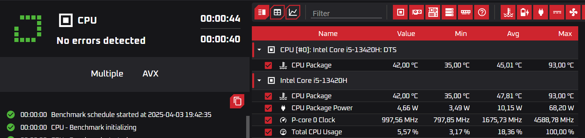

# Guía de Uso de OCCT

## Introducción

**OCCT (OverClock Checking Tool)** es una herramienta de benchmarking y pruebas de estabilidad para CPU, GPU y fuentes de alimentación. Es útil para detectar problemas de hardware y evaluar el rendimiento del sistema bajo estrés.

---

## Descarga e Instalación

### Paso 1: Descargar OCCT

1. Visita el sitio web oficial: [https://www.ocbase.com/](https://www.ocbase.com/).
2. Descarga la versión más reciente de OCCT (gratuita o de pago). Como muestra la imagen, las de abajo son de pago y la de arriba es gratuita.    
3. Te aparecerán dos tipos en la pestaña principal: "stable" y "test". Si necesitas OCCT para pruebas normales de estabilidad del sistema, la opción **Stable** es la mejor. Si te interesa probar nuevas funciones antes de su lanzamiento oficial y no te importa la posibilidad de fallos, puedes optar por **Test**. 
    
    

### Paso 2: Instalar OCCT

1. Abre el archivo descargado (`OCCT_Setup.exe`).
2. Sigue las instrucciones del instalador.
3. Una vez instalado, inicia la aplicación.

---

## Uso Básico

### Paso 1: Configurar la Prueba de Estrés

1. Abre **OCCT**.
2. En la pantalla principal, selecciona el tipo de prueba:     
   - **CPU**: Prueba de estabilidad del procesador.  
   - **CPU + RAM**: Evalúa el rendimiento del procesador junto con la memoria RAM.  
   - **3D Standard**: Test de rendimiento gráfico para la GPU.   
   - **Power**: Simula una carga extrema para verificar la estabilidad de la fuente de alimentación.  
   - **Memory**: Analiza la estabilidad y rendimiento de la memoria RAM.  
3. Conoce también las otras utilidades de OCCT:

* **Linpack**: Prueba intensiva para la CPU utilizando el benchmark Linpack.  
* **3D Adaptive**: Prueba de la GPU con variaciones de carga para evaluar su estabilidad.  
* **VRAM**: Examina la memoria de la tarjeta gráfica para detectar fallos o inestabilidad.  
* **Monitoring Only**: Muestra datos en tiempo real sobre temperaturas, voltajes y uso del hardware sin ejecutar pruebas de estrés.  
* **Combined**: Realiza pruebas simultáneas en CPU, GPU y RAM para evaluar el rendimiento general del sistema.  

4. Configura la duración y el nivel de estrés. Para **pruebas estándar** , **1 hora** es suficiente para detectar inestabilidad en la mayoría de los casos. Si estás probando **overclocking o estabilidad extrema**, lo mejor es extender el test a **4+ horas**. En nuestro caso haremos una prueba mínima que tendrá una duración de unos 15-30mins.     
5. Haz clic en **Start** para iniciar la prueba.   

---

### Paso 2: Test de estabilidad de CPU+RAM

Esta es la vista general de la prueba. Ahora hablaremos más en específico de cada una de las características.

   

- **CPU**: Los resultados muestran que los **P-cores** del Intel Core i5-13420H, especialmente el **P-core 1** , alcanzaron temperaturas críticas de **91,00 °C** (con solo **9,00 °C** de margen hasta el límite seguro), mientras el **CPU Package** registró **90,00 °C** , indicando un **riesgo de sobrecalentamiento** bajo cargas intensivas. Los **E-cores** se mantuvieron estables (máximo **78,00 °C**), y las temperaturas mínimas/promedio están dentro de rangos normales. Aunque el sistema opera bien en reposo, los picos térmicos en los núcleos de rendimiento sugieren revisar la refrigeración (ventiladores, pasta térmica) y evitar cargas prolongadas sin monitorización para prevenir daños a largo plazo..      
- **Temperaturas y voltajes**: Comprueba si los valores son estables. La temperatura de **90,00 °C** destaca por ser elevada, lo que podría indicar un posible sobrecalentamiento bajo carga extrema o fallas en el sistema de refrigeración. Las demás mediciones se encuentran dentro de rangos típicos para un CPU en funcionamiento normal. Se recomienda monitorear la temperatura máxima en situaciones de alto rendimiento para evitar daños.      
- **GPU**: En el test de GPU, verifica la estabilidad del rendimiento gráfico.La **GPU NVIDIA GeForce RTX 3050 6GB** está funcionando de manera eficiente, con una temperatura máxima de **50.31°C**, dentro de un rango seguro y sin riesgo de sobrecalentamiento. Su consumo es bajo, **11.54W**, indicando que está en reposo o en uso ligero. La frecuencia del núcleo alcanza **1432 MHz**, en un nivel intermedio, y los voltajes se mantienen estables dentro de lo normal. En general, la GPU opera sin problemas térmicos ni de voltaje.  
      
- **RAM**: La memoria RAM muestra un rendimiento estable, con voltajes dentro de los valores normales y sin fluctuaciones preocupantes. Sin embargo, la temperatura máxima alcanzó **57.75°C** , un valor algo elevado, aunque no crítico. Esto podría deberse a una carga alta o a una ventilación limitada. Si bien no representa un problema inmediato, es recomendable monitorearla en sesiones prolongadas para evitar posibles sobrecalentamientos..      
- **Errores detectados**: Si OCCT encuentra fallos, puede ser señal de inestabilidad en tu hardware. En nuestro caso no nos encuentra ningun error.     

---

### Paso 3: Benchmark de CPU

   

- **CPU**: Los resultados muestran un comportamiento térmico y de rendimiento crítico en el procesador. 

* **Presencia de temperaturas elevadas** : El *CPU Package* alcanzó **93,00 °C** en ambas mediciones, valor cercano al límite seguro (~100 °C), lo que sugiere **sobrecalentamiento** bajo cargas intensivas.  
* **Frecuencias y potencia** :
  
  * Frecuencia máxima del *P-core 0* : **4588,78 MHz
  * (turbo boost activo), indicando esfuerzo para manejar cargas pesadas.
  * Potencia máxima del paquete: **68,20 W** , reflejando alta demanda energética.  
* **Uso del CPU** : Alcanzó el **100%** , confirmando saturación durante tareas intensivas.  
* **AVX (Advanced Vector Extensions)** : La mención de "Multiple AVX" sugiere uso de instrucciones vectoriales, que generan mayor calor y consumo energético.

### **Riesgos y recomendaciones**

* **Refrigeración insuficiente** : Las temperaturas cercanas a 95°C exigen revisar ventiladores, pasta térmica y flujo de aire.  
* **Throttling térmico** : Operar cerca del límite térmico puede reducir el rendimiento para proteger el hardware.  
* **Cargas sostenidas** : Evitar uso prolongado al 100% sin supervisión, especialmente con AVX.  

**Conclusión** : El CPU funciona bajo estrés térmico y de carga, con riesgo de daño a largo plazo. Se recomienda **mejorar la refrigeración** y optimizar cargas de trabajo para equilibrar rendimiento y temperatura.  

### Paso 4: Benchmark de RAM

  
En el marco de las pruebas de rendimiento realizadas, se constató que la memoria RAM registró velocidades de **lectura en 675.64 MB/s**, **escritura en 577.34 MB/s** y **operación combinada en 645.62 MB/s,**  cumpliendo con los estándares esperados sin detectar incidencias durante la ejecución. Los parámetros de **voltaje** (ej: VDD en 1.110 V) y **temperatura** (máximo de 39,50 °C en el módulo de memoria) se mantuvieron dentro de rangos óptimos, sin evidencia de sobrevoltaje, subvoltaje o desviaciones críticas. Los resultados, subidos a la plataforma *Ocbase* , confirman un **funcionamiento estable y eficiente del hardware** bajo condiciones de carga, validando su integridad operativa y capacidad de rendimiento conforme a las especificaciones técnicas. 

---

## Conclusión

OCCT es una herramienta esencial para evaluar el rendimiento y la estabilidad de tu PC. Si detectas temperaturas elevadas o inestabilidad, considera mejorar la refrigeración o ajustar la configuración de overclocking.

> **Consejo:** Si OCCT detecta errores en la CPU o GPU, prueba a reducir el overclock o mejorar la ventilación de tu equipo.

---

**¡Esperamos que esta guía te ayude a probar tu sistema de manera efectiva!**

