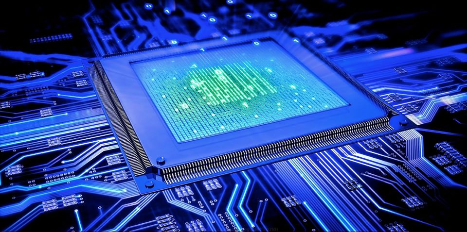
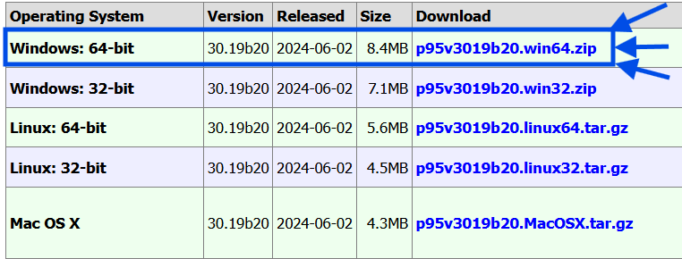
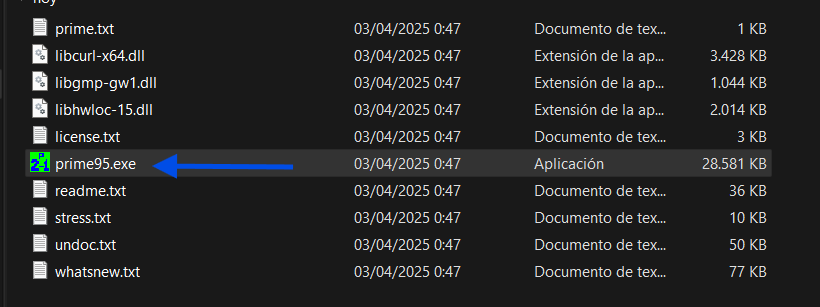
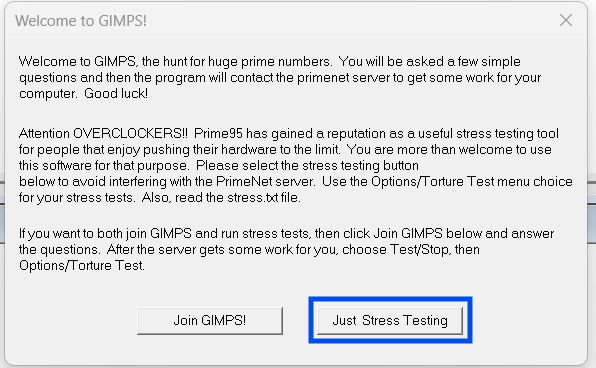
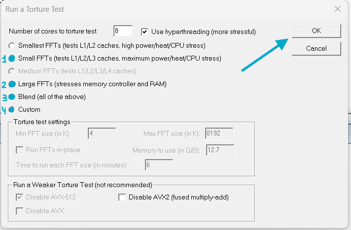
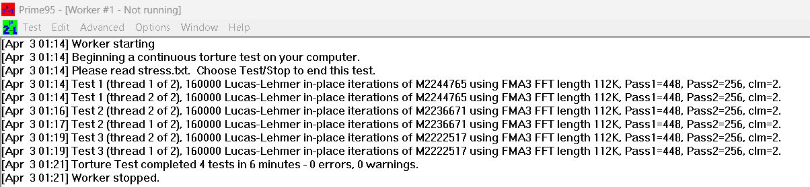
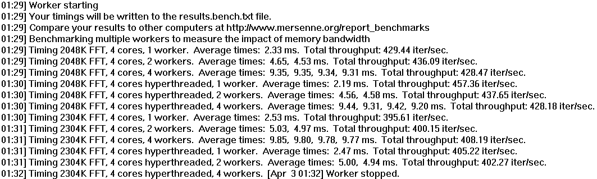

# Guía de Uso de Prime95

## Introducción

Prime95 es una herramienta utilizada para realizar pruebas de estrés en la CPU y la memoria RAM. Es ampliamente utilizada para verificar la estabilidad del sistema, especialmente en equipos overclockeados o para detectar problemas de hardware.

---

## Descarga e Instalación

### Paso 1: Descargar Prime95

1. Visita el sitio web oficial de Prime95: [https://www.mersenne.org/download/](https://www.mersenne.org/download/).
    
2. Descarga la versión correspondiente a tu sistema operativo (Windows, Linux o macOS). En nuestro caso elegiremos la version de Windows x64. 
   

### Paso 2: Instalar Prime95

1. Si descargaste la versión portátil (sin instalación), simplemente extrae el contenido del archivo ZIP en una carpeta.
2. Abre la carpeta extraída y ejecuta `prime95.exe`.
   

---

## Uso Básico

### Paso 1: Iniciar una Prueba de Estrés

1. Abre Prime95.
2. Al iniciarse, aparecerá una ventana preguntando si deseas unirte al programa de búsqueda de miembros prime. Si solo deseas hacer pruebas de estrés, selecciona **"Just Stress Testing"**. 
     
3. Selecciona el tipo de prueba: 
     
   
   - **1º Small FFTs**: Para probar principalmente la CPU.  
   - **2º In-place large FFTs**: Para una combinación de CPU y memoria RAM.  
   - **3º Blend**: Para probar tanto CPU como memoria RAM de manera equilibrada.  
   - **4º Custom**: Esta opción es útil si quieres ajustar la prueba para evaluar ciertos aspectos de tu hardware con más precisión.  
4. Haz clic en **OK** para iniciar la prueba.

### Paso 2: Interpretar los Resultados

- Prime95 ejecutará cálculos intensivos en tu CPU y RAM.
- Si tu sistema es estable, la prueba continuará sin errores. 
- Si ves errores o bloqueos, puede ser una señal de inestabilidad en el hardware.

### Captura de pantalla del análisis:

Como mencionabamos antes, si nos hubiera detectado algun fallo o error, hubiera sido un síntoma de algún problema en nuestro hardware, pero no es el caso. La prueba de estrés fue superada sin problema alguno.

Nuestra CPU pasó la prueba sin problemas. Sin embargo, **6 minutos es un tiempo corto** para una prueba de estabilidad real. Para verificar bien el sistema, es recomendable ejecutar el **Torture Test** durante al menos 1-2 horas o más. 

  

### Captura de pantalla del resultado del test de benchmark:

Nos muestra que nuestrfa CPU maneja bien las cargas de trabajo, con tiempos de ejecución esperados y sin errores.

* **Con 1 worker** , el rendimiento es más alto porque usa toda la CPU sin dividir la carga.
* **Con 4 workers** , el rendimiento total baja un poco, lo cual es normal al distribuir el trabajo entre hilos.
* **FFT 2048K vs. 2304K:** La segunda es un poco más exigente, con tiempos más altos y menor rendimiento en iteraciones por segundo.

En general, nuestra CPU funciona de manera estable y eficiente bajo estrés. 

---

## Conclusión

Prime95 es una herramienta esencial para evaluar la estabilidad del hardware. Si tu equipo pasa varias horas de prueba sin errores, es una buena señal de que la CPU y la RAM están funcionando correctamente.

> **Consejo:** Si el sistema se congela o muestra errores, intenta reducir el overclocking o mejorar la refrigeración.

---

**¡Esperamos que esta guía te ayude a probar la estabilidad de tu equipo de manera efectiva!**🚀

