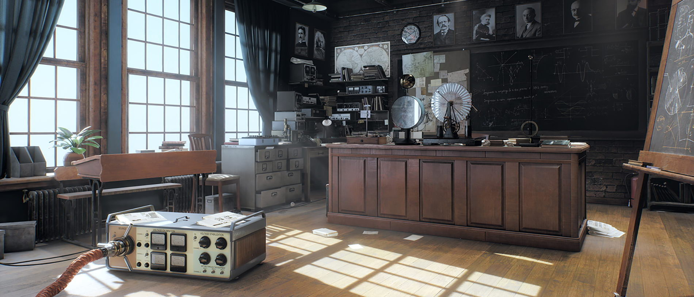
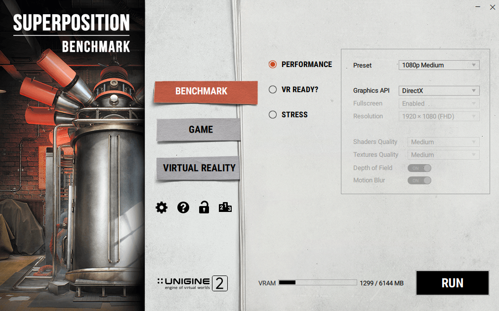
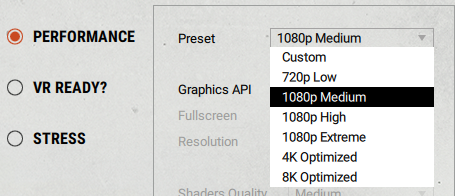
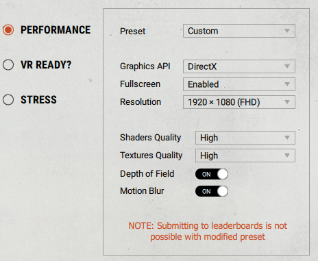
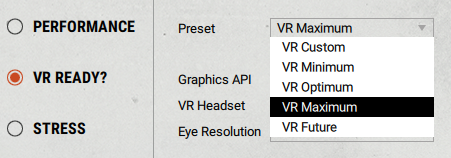
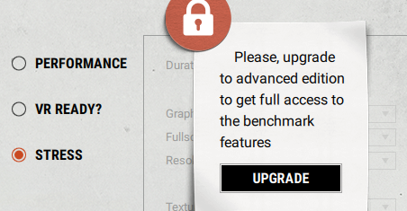
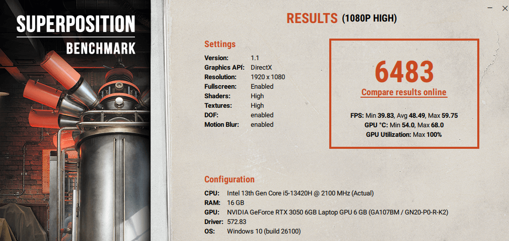

# Guía de Uso de Unigine Superposition

## Introducción

Unigine Superposition es una herramienta avanzada de benchmarking utilizada para evaluar el rendimiento de la GPU y la estabilidad del sistema bajo cargas gráficas intensas. Es ideal para pruebas de overclocking y comparación de hardware.

---

## Descarga e Instalación

### Paso 1: Descargar Unigine Superposition

1. Visita el sitio web oficial de Unigine Superposition: [https://benchmark.unigine.com/superposition](https://benchmark.unigine.com/superposition).   
2. Descarga la versión gratuita o la de pago, según tus necesidades. En nuestro caso, descargaremos la versión gratuita. 
   

### Paso 2: Instalar Unigine Superposition

1. Abre el archivo descargado (`Superposition_Benchmark.exe`)  
2. Sigue las instrucciones del asistente de instalación.  
3. Una vez instalado, inicia la aplicación. Te deberá aparecer el siguiente menú:
   

---

## Uso Básico

### Paso 1: Configurar el Benchmark

1. Abre **Unigine Superposition**.   
2. Selecciona la configuración del benchmark:
   - **Presets predefinidos**: 720p Low, 1080p Medium, 1080p High, 4K Optimized, 8K. Nosotros elegiremos para la prueba la version 1080p High que es lo que más se acerca a la realidad.    
   - **Configuración personalizada**: Ajusta resolución, calidad de texturas, iluminación y otros parámetros. Esto lo podremos encontrar en el apartado "Custom" para poder modificarlo a nuestra elección.    
3. Aparte de encontrarnos la performance normal, tenemos otras dos opciones extras. En este caso hablamos de la posibilidad de usar realidad virtual con sus ajustes, que los podremos poner a nuestra elección y el apartado de "stress" que es de pago y que no nos dejaría usarlo a no ser que paguemos.      
4. Asegúrate de que la opción **Fullscreen** está activada para una prueba realista.  
5. Haz clic en **RUN** para iniciar el benchmark.

### Paso 2: Interpretar los Resultados

- Al finalizar, el programa mostrará:
  - **Puntaje final** (Score): Refleja el rendimiento general de la GPU.
  - **FPS promedio, mínimo y máximo**: Importante para evaluar estabilidad.
  - **Temperatura de la GPU**: Indicador clave de sobrecalentamiento.

### Resultado de la prueba de rendimiento y conclusion acerca de la misma:

Acerca del resultado de la prueba:
La RTX 3050 de nuestro equipo, aunque eficiente, enfrenta límites en **1080p High** por su arquitectura y memoria reducida (6 GB). Los **48 FPS promedio** reflejan su capacidad para juegos actuales en alto, pero con compromisos:

* El 100% de uso de GPU confirma que no hay margen para multitarea, como por ejemplo streaming.  
* **Efectos activados como DOF o Motion Blur** consumen recursos... desactivarlos podría elevar FPS sin pérdida visual notable.  
* **Temperaturas estables (68°C máx)** : Buen termal en portátil, pero monitorea en cargas prolongadas.

**Comparativa** : En benchmarks similares, la RTX 3050 suele puntuar entre **6000-7000** en 1080p High, ubicando nuestro resultado en el rango esperado. Ideal para juegos AAA en alto-medio, no ultra. Si buscas más rendimiento, considera priorizar DLSS o ajustes específicos (sombras, anti-aliasing).

---

## Conclusión

Unigine Superposition es una herramienta poderosa para evaluar el rendimiento gráfico de tu PC. Si obtienes una puntuación baja o temperaturas altas, considera ajustar la refrigeración o mejorar la GPU.

> **Consejo:** Compara tu puntuación con otros sistemas similares en la web oficial de Unigine para ver cómo se compara tu hardware.

---

**¡Esperamos que esta guía te ayude a medir el rendimiento de tu equipo de manera efectiva!**

