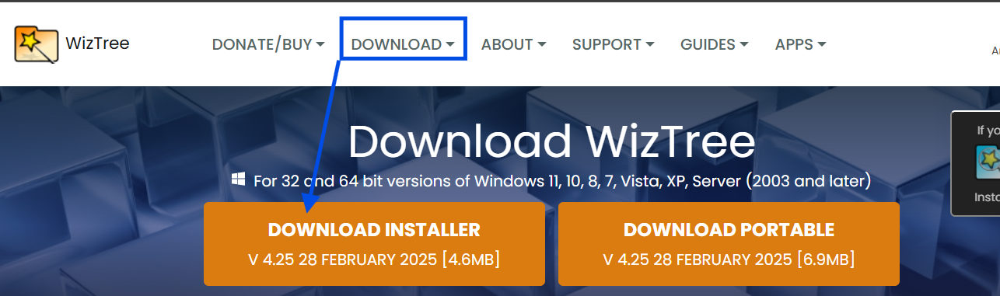
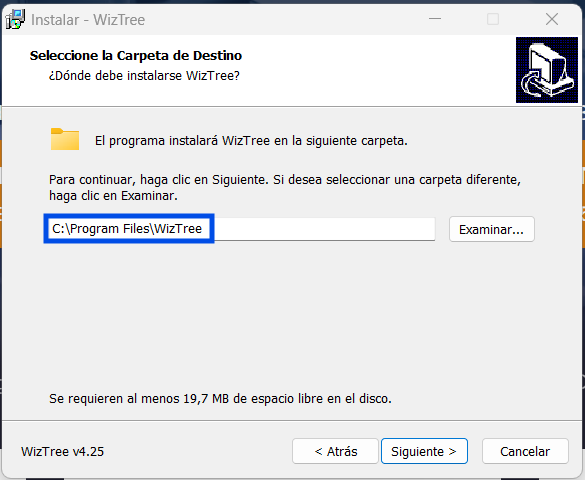
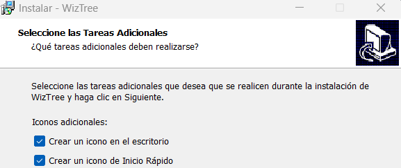
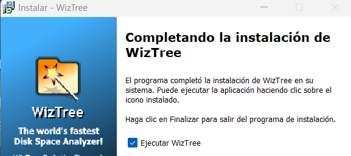
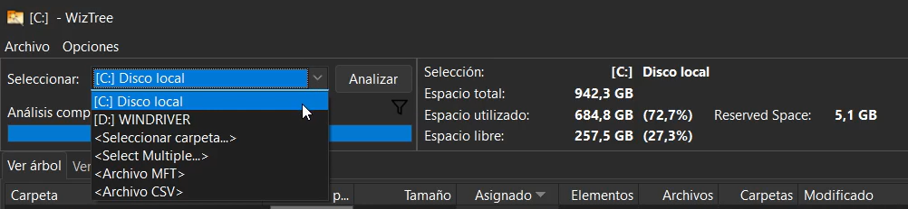
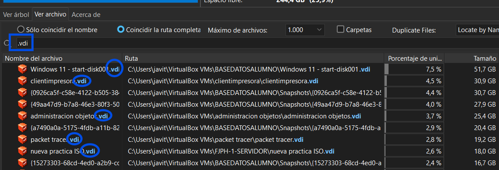
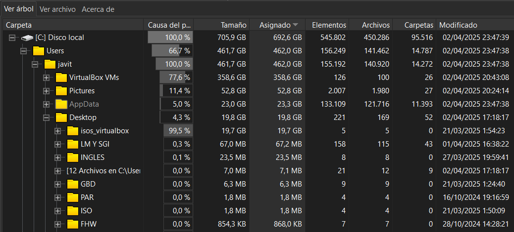
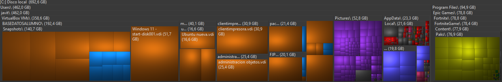

# Guía de Uso de WizTree

## Introducción

WizTree es una aplicación que te permite analizar el uso del almacenamiento en tu equipo de manera rápida y eficiente. Con esta herramienta, puedes visualizar qué archivos y carpetas ocupan más espacio en tu disco duro, facilitando la gestión y limpieza de archivos innecesarios.

---

## Descarga e Instalación

### Paso 1: Descarga WizTree en tu equipo

1. Accede al sitio web oficial de WizTree: [https://diskanalyzer.com/](https://diskanalyzer.com/).  
2. Descarga la versión más reciente del instalador o la versión portátil (sin instalación requerida).
   

### Paso 2: Proceso de instalación de WizTree

1. Si descargaste el instalador, haz doble clic en el archivo descargado.
    
2. Sigue las instrucciones en pantalla y selecciona la carpeta de instalación.
     
3. Después aparecerá una ventana que te aparecerá la posibilidad de crearte un acceso directo en el escritorio para tenerlo a mano, pues esta opción la marcamos.
     
4. Una vez finalizada la instalación, ejecuta WizTree.
     

---

## Cómo usar WizTree

### Paso 1: Analizar un Disco

1. Abre WizTree.  
2. Una vez ejecutada la aplicación, en la parte superior izquierda tendremos que elegir qué disco o carpeta queremos examinar. En nuestro caso será el SSD principal de nuestro sistema [C:] Disco local.   
3. Haz clic en el botón **"Analizar"** y espera a que el análisis termine.
     

### Paso 2: Saber interpretar los Resultados

- **"Ver Archivo"**: Esta pestaña nos sirve a la hora de buscar una extensión de archivo/carpeta en específico para que sólo nos salgan esos resultados en específico para especificar su búsqueda. También nos da la posibilidad de no sólo la búsqueda en la que coincida la ruta completa sino que también pueden pertenecer los archivos a rutas distintas y al mantener el mismo nombre también nos los buscaría.
    
- **"Ver Árbol"**: Permite navegar por las carpetas y ver su tamaño relativo. En este caso el usuario "javit" ocupa el 100% del espacio de la carpeta "Users" y vemos en qué carpetas se distribuye ese espacio de almacenamiento, como por ejemplo la carpeta de "VirtualBox VMs" ocupa 358,6 GB del espacio total.
    
- **Mapa de Treemap**: Representa visualmente el uso del almacenamiento con colores y tamaños proporcionales. En este caso VirtualBox VMs se lleva la grán parte del espacio usado en el disco como podemos observar.
   

---

## Conclusión

WizTree es una herramienta extremadamente útil para gestionar el almacenamiento en tu equipo. Con su análisis rápido y su interfaz intuitiva, puedes identificar y eliminar archivos innecesarios con facilidad.

> **Consejo:** Para evitar eliminar archivos importantes, revisa con cuidado antes de borrar archivos grandes.

---

**¡Esperamos que esta guía te ayude a optimizar el espacio en tu disco!**

